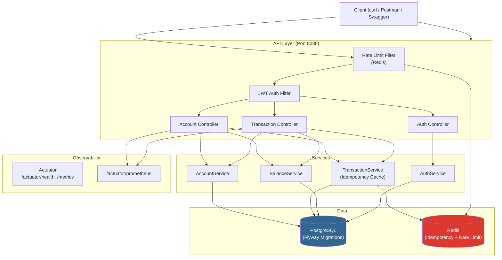
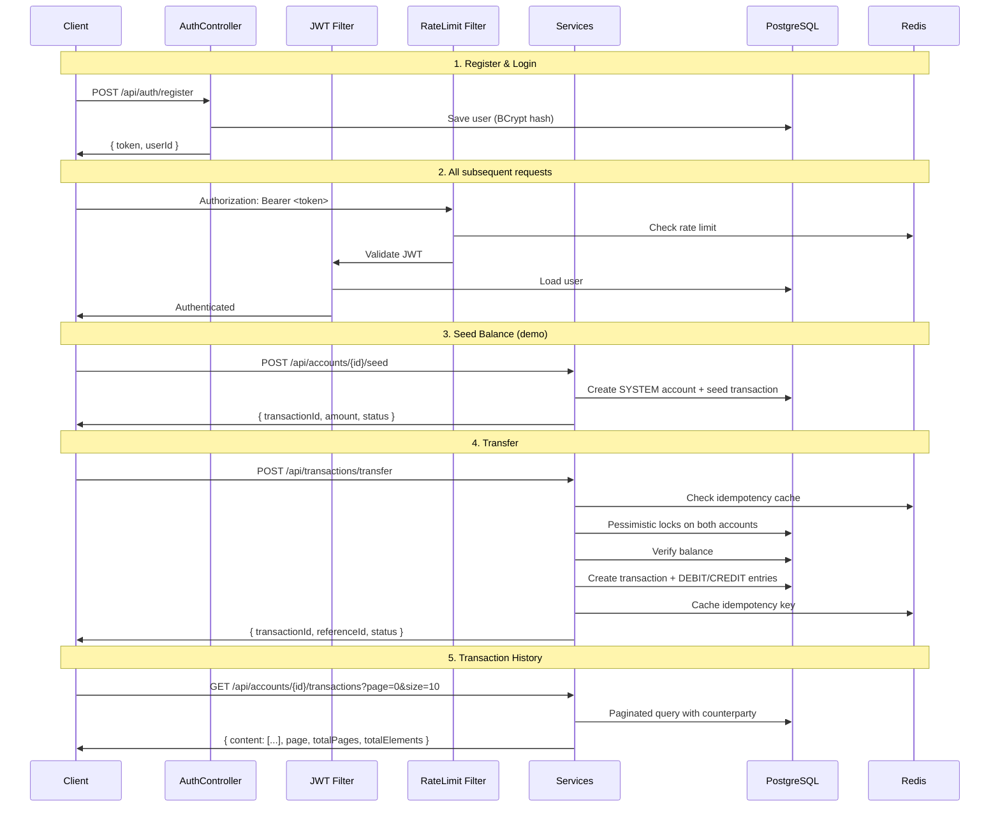

# vaultcore-ledger

Core Accounting Engine — a double-entry ledger system with **Spring Boot 4.0**, **Java 21**, **PostgreSQL**, **Redis**, **JWT auth**, and **Prometheus metrics**.

---

## Architecture



---

## Tech Stack

| Component | Technology |
|---|---|
| **Runtime** | Java 21, Spring Boot 4.0.3 |
| **Database** | PostgreSQL 16 (Flyway migrations) |
| **Cache** | Redis 7 (idempotency, rate limiting) |
| **Auth** | JWT (jjwt 0.12), Spring Security, BCrypt |
| **API Docs** | Springdoc OpenAPI (Swagger UI) |
| **Metrics** | Micrometer + Prometheus |
| **Tests** | JUnit 5, Testcontainers |
| **Build** | Maven (w/ wrapper) |
| **Deploy** | Docker / GitHub Actions |

---

## Quick Start (Recruiter-Friendly)

> **Live demo:** [https://vaultcore-cg6x.onrender.com/swagger-ui/index.html](https://vaultcore-cg6x.onrender.com/swagger-ui/index.html)
> Register a user, authorize with the Bearer token, and try all endpoints instantly.

### Prerequisites

- [Docker Desktop](https://docs.docker.com/get-docker/)
- Java 21+ (optional, for local dev)

### 1. Start all services

```bash
docker compose up -d
```

This starts PostgreSQL, Redis, and the application on `localhost:8080`.

### 2. Verify it's running

```bash
curl http://localhost:8080/actuator/health
```

### 3. Register a user

```bash
curl -s -X POST http://localhost:8080/api/auth/register \
  -H "Content-Type: application/json" \
  -d '{"name":"Demo User","phoneNumber":"+919999999999","password":"secret123"}' | jq
```

Save the `token` from the response.

### 4. Create an account

```bash
AUTH="Authorization: Bearer <token>"

# Get the user ID from the register response
USER_ID="<userId from step 3>"

curl -s -X POST http://localhost:8080/api/accounts \
  -H "Content-Type: application/json" \
  -H "$AUTH" \
  -d "{\"userId\":\"$USER_ID\",\"accountType\":\"USER\"}" | jq
```

Save the `id` and `accountNumber` from the response.

### 5. Seed the balance (demo)

```bash
ACCOUNT_ID="<account id from step 4>"
ACCOUNT_NUM="<accountNumber from step 4>"

curl -s -X POST http://localhost:8080/api/accounts/$ACCOUNT_ID/seed \
  -H "Content-Type: application/json" \
  -H "$AUTH" \
  -d '{"amount":10000}' | jq
```

### 6. Check balance

```bash
curl -s "http://localhost:8080/api/accounts/$ACCOUNT_ID/balance" \
  -H "$AUTH" | jq
```

### 7. Transfer money

```bash
# Create a second account first
ACC2=$(curl -s -X POST http://localhost:8080/api/accounts \
  -H "Content-Type: application/json" \
  -H "$AUTH" \
  -d "{\"userId\":\"$USER_ID\",\"accountType\":\"USER\"}" | jq)
echo "$ACC2" | jq .
ACC2_ID=$(echo "$ACC2" | jq -r '.id')
ACC2_NUM=$(echo "$ACC2" | jq -r '.accountNumber')

# Transfer by UUID
curl -s -X POST http://localhost:8080/api/transactions/transfer \
  -H "Content-Type: application/json" \
  -H "$AUTH" \
  -d "{
    \"fromAccountId\":\"$ACCOUNT_ID\",
    \"toAccountId\":\"$ACC2_ID\",
    \"amount\":2500
  }" | jq

# Transfer by account number (easier for demos)
curl -s -X POST http://localhost:8080/api/transactions/transfer-by-account-number \
  -H "Content-Type: application/json" \
  -H "$AUTH" \
  -d "{
    \"fromAccountNumber\":\"$ACCOUNT_NUM\",
    \"toAccountNumber\":\"$ACC2_NUM\",
    \"amount\":1500
  }" | jq
```

### 8. View transaction history

```bash
curl -s "http://localhost:8080/api/accounts/$ACCOUNT_ID/transactions?page=0&size=10" \
  -H "$AUTH" | jq
```

### 9. Swagger UI

Open [http://localhost:8080/swagger-ui.html](http://localhost:8080/swagger-ui.html)

Click the **Authorize** button at the top right and paste `Bearer <token>` to authenticate all requests from Swagger UI.

---

## API Reference

### Auth

| Method | Path | Auth | Description |
|---|---|---|---|
| `POST` | `/api/auth/register` | No | Register a new user |
| `POST` | `/api/auth/login` | No | Login, returns JWT |

### Accounts

| Method | Path | Auth | Description |
|---|---|---|---|
| `POST` | `/api/accounts` | Yes | Create an account |
| `GET` | `/api/accounts/{id}/balance` | Yes | Get account balance |
| `GET` | `/api/accounts/{id}/transactions` | Yes | Transaction history (paginated) |
| `POST` | `/api/accounts/{id}/seed` | Yes | Seed balance (demo only) |

### Transactions

| Method | Path | Auth | Description |
|---|---|---|---|---|
| `POST` | `/api/transactions/transfer` | Yes | Transfer by account UUIDs |
| `POST` | `/api/transactions/transfer-by-account-number` | Yes | Transfer by account numbers (friendlier) |

### Actuator / Observability

| Method | Path | Description |
|---|---|---|
| `GET` | `/actuator/health` | Health check (DB + Redis) |
| `GET` | `/actuator/metrics` | Application metrics |
| `GET` | `/actuator/prometheus` | Prometheus scrape endpoint |

---

## API Flow



---

## Key Design Decisions

### Double-Entry Ledger
Every transfer creates exactly one **DEBIT** and one **CREDIT** entry. Balances are computed as `SUM(credits) - SUM(debits)`.

### Concurrency Protection
- **Pessimistic WRITE locks** on both accounts during transfers
- **Consistent lock ordering** (compare UUIDs) prevents deadlocks
- **Idempotency keys** prevent duplicate processing (Redis + DB)
- **Optimistic locking** (`@Version`) on accounts

### Security
- JWT-based stateless authentication
- BCrypt password hashing
- Rate limiting via Redis (100 req/min per user by default)

### Observability
- Micrometer metrics at `/actuator/prometheus`
- Custom metrics: `ledger.transactions.*`, `ledger.balance.queries`, `ledger.ratelimit.hits`
- Timer percentiles (p50, p95, p99) for transaction and query durations

---

## Environment Variables

| Variable | Default | Description |
|---|---|---|
| `SPRING_DATASOURCE_URL` | `jdbc:postgresql://localhost:5432/vaultcore` | PostgreSQL JDBC URL |
| `SPRING_DATASOURCE_USERNAME` | `divijmazumdar` | DB username |
| `SPRING_DATASOURCE_PASSWORD` | *(empty)* | DB password |
| `REDIS_HOST` | `localhost` | Redis host |
| `REDIS_PORT` | `6379` | Redis port |
| `JWT_SECRET` | *(dev secret)* | HMAC-SHA key (base64) |
| `JWT_EXPIRATION` | `86400000` | Token TTL in ms (24h) |
| `RATE_LIMIT_MAX_REQUESTS` | `100` | Max requests per window |
| `RATE_LIMIT_WINDOW_MINUTES` | `1` | Rate limit window duration |

---

## Deployment

### Docker

```bash
docker compose up -d --build
```

### CI/CD (GitHub Actions)

Push to `main` or open a PR to trigger the CI pipeline at `.github/workflows/ci.yml`:

- JDK 21 setup
- Maven build + test (with Testcontainers)
- PostgreSQL + Redis service containers

---

## Screenshots

> *Swagger UI:* `http://localhost:8080/swagger-ui.html`
>
> *Health check:* `GET /actuator/health`
>
> *Prometheus metrics:* `GET /actuator/prometheus`
>
> 
> 
> 
